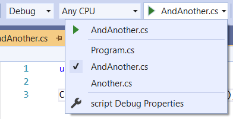
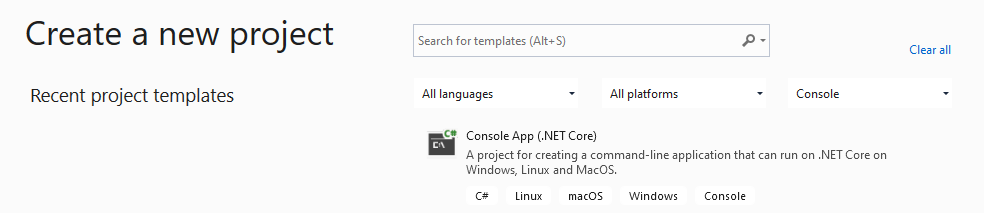
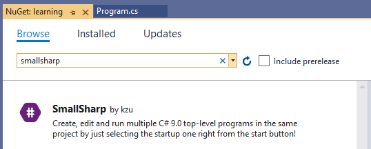

 SmallSharp
============

Create, edit and run multiple C# 9.0 top-level programs in the same project by just selecting the startup file right from the Run button!



[](https://www.nuget.org/packages/SmallSharp)
[](https://www.nuget.org/packages/SmallSharp)
[](https://github.com//kzu/SmallSharp/blob/main/LICENSE)
[](https://github.com/kzu/SmallSharp/actions)
[](https://pkg.kzu.io/index.json)

## Why

The new C# 9 [top-level programs](https://devblogs.microsoft.com/dotnet/welcome-to-c-9-0/#top-level-programs) allow a very intuitive, simple and streamlined experience for quickly spiking or learning C#. 

One missing thing since its introduction in Visual Studio 16.8 is that you can only have one such top-level programs in a project. This means that in order to prototype or learn a different area of .NET, you'd be forced to either replace your previous top-level program or change it to be a non-compile item somehow so you can keep it around (i.e. rename to a `.txt` or change its build action).

**SmallSharp** brings that very feature by automatically generating a launch profile for each `.cs` file at the project level so you can just select which top-level program should be the startup item (for compilation and launch/debug).

This list is automatically kept in sync as you add more `.cs` files to the project. When you select one target C# file, that becomes the only top-level program to be compiled, so you don't have to modify any of the others since they automatically become *None* items.

All compile files directly under the project directory root are considered top-level programs for selection and compilation purposes. If you need to share code among them, you can place them in subdirectories and those will behave like normal compile items.

## Usage

There is no need to install any Visual Studio extension. SmallSharp works by just installing the `SmallSharp` nuget package in a C# 9.0 project (such as a .NET 5.0 project).

1. Create a new Console (.NET Core):




   By default, this new console project may not be set up to target `net5.0` or use the latest C# version. 
   So click on the project node, and the project file will open in the editor. Make sure you either:

  * Target `net5.0` framework:

```xml
<Project Sdk="Microsoft.NET.Sdk">

  <PropertyGroup>
    <OutputType>Exe</OutputType>
    <TargetFramework>net5.0</TargetFramework>
  </PropertyGroup>

</Project>
```

  * Or use latest C# language version if targeting another framework:

```xml
<Project Sdk="Microsoft.NET.Sdk">

  <PropertyGroup>
    <OutputType>Exe</OutputType>
    <TargetFramework>net472</TargetFramework>
    <LangVersion>latest</LangVersion>
  </PropertyGroup>

</Project>
```
 
2. Install the **SmallSharp** nuget package using your preferred method:

  * From the Dependencies node, Manage NuGet Packages dialog:



   * By just adding it directly to the .csproj:

```xml
  <ItemGroup>
    <PackageReference Include="SmallSharp" Version="*" />
  </ItemGroup>
```

   * Via the dotnet CLI:

```
> dotnet add package SmallSharp
```

   * Via the Package Manager console:

```
PM> install-package SmallSharp
```

3. Now open that Program.cs, and replace it all with a nice concise top-level program like:

```csharp
using System;
using static System.Console;

WriteLine("Hello World!");
```

Keep adding as many top-level programs as you need, and switch between them easily from the Run button dropdown.


